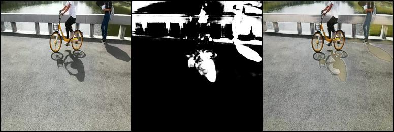

本项目是基于ST_CGAN的基础上进行阴影去除的尝试以及模型的改进，改进的思路主要是通过网络结构的改变是否能够带来效率或则精度的提升，另外本项目利用最新的实例阴影去除研究Instance Shadow Diffusion来进一步配合ST_CGAN实现阴影去除。

## 依赖
* Python3.8
* PyTorch 1.7.1

## 数据集
数据集主要是用的ST-CGAN提供的ISTD（Dataset with Image Shadow Triplets）数据集，来自 [这里](https://github.com/DeepInsight-PCALab/ST-CGAN)。这个数据集提供原图、阴影掩码、去除阴影图三中模态的数据。它总共有1870个数据，所以训练的数据量大小也是比较合理的。（这里值得一提的是，本数据集和所给的测试图片的分布还是一定的差异的）
## 方法
ST-CGAN的原理图如下，它整体架构是堆叠的两个条件生成对抗外网络所组成的，第一个生成对抗外网络负责接收原图预测阴影掩码，第二个生成对抗外网络负责接收原图和阴影掩码预测去除阴影的图像。每个生成对抗外网络里面包含一个生成器G和判别器D，生成器G主要是由的全卷积神经网络构成的类UNet分割模型，判别器D也是卷积神经网络构成的分类模型。

生成器G是类Unet模型，所以我们可以进行尝试利用UNet家族的一些网络结构去替换生成器G的结构，测试是否可以有效率或则精度的提升。这里我主要是是用UNext网络来替换生成器G内容，UNext是一个轻量级的模型，利于用CPU进行推理运算，它内容利用深度可分离卷积来替换普通卷积层，还利用Tokenied-MLP来模拟Metaformer的一些特性来改善学习能力，它的原理图如下：


两个模型的参数量和计算量的对比为：
| 模型名称       | 参数量 (M) | 计算量 (GFLOPs) | 吞吐量 (samples/s) |
|----------------|------------|-----------------|-------------------------|
| ST_CGAN        | 29.24      | 17.88           | 21.15                     |
| ST_CGAN_S      | 1.47       | 0.57            | 46.94                     |
 
ST_CGAN_S是我尝试改进的模型

测试平台 CPU：AMD EPYC 7542 32-Core Processor 单核1.5GHz
参数量和计算量都是通过(1, 3, 256, 256)的tensor计算的。

## 训练
```
python3 train.py
```
ST_CGAN模型在训练时的损失：


ST_CGAN_s模型在训练时的损失：

## 测试
```
python3 infer.py
```
这里测试只对比要求的三个示例图片，首先是ST_CGAN模型的预测结果（从左到右分别是原图，预测阴影，去除阴影图）：




另外是 ST_CGAN_S的结果：


分析：

第一幅图可以看出模型只是简单的学习了深色和浅色的区别，并没有真正认识到影子的概念

所给的示例中，第二幅图是比较符合数据分布的图片，但是可以看到两个模型都很难恢复阴影下的内容而保留了人体的轮廓，我猜测可能是因为阴影颜色过于黑，原图细节丢失得太多了。这样任务可能会变成一个“纯图像生成”的任务

第三幅图模型没有区分场景黑暗和小狗的影子。


## 探索
由于精度有限，我尝试利用最新方法Instance Shadow Diffusion来配合ST_CGAN测试是否有改进。Instance Shadow Diffusion它的原理主要是把原图和阴影掩码作为一个隐藏变量给Diffusion进行多轮的预测来恢复原图的效果，模型的原理图为：


我们可以把ST-CGAN生成的阴影掩码给Instance Shadow Diffusion，这样就不用手动进行掩码的标注。下面是预测结果：


可以看到的是有一点点的改善，但不是特别显著。

## ROS1支持

服务协议ShadowRemoval.srv实现了客服端传入一个有阴影的图片，返回一个去除阴影的图片

```cpp
sensor_msgs/Image input_image
---
sensor_msgs/Image output_image
```
编译:
```bash
cd ros
catkin build
source devel/setup.bash
```

ros通信实现效果：


## References
* Stacked Conditional Generative Adversarial Networks for Jointly Learning Shadow Detection and Shadow Removal, Jifeng Wang<sup>∗</sup>, Xiang Li<sup>∗</sup>, Le Hui, Jian Yang, **Nanjing University of Science and Technology**, [[arXiv]](https://arxiv.org/abs/1712.02478)
* Mei, K., Figueroa, L., Lin, Z., Ding, Z., Cohen, S., Patel, V.M., 2024. Latent Feature-Guided Diffusion Models for Shadow Removal, in: 2024 IEEE/CVF Winter Conference on Applications of Computer Vision (WACV). Presented at the 2024 IEEE/CVF Winter Conference on Applications of Computer Vision (WACV), IEEE, Waikoloa, HI, USA, pp. 4301–4310. https://doi.org/10.1109/WACV57701.2024.00426
* Valanarasu, J.M.J., Patel, V.M., 2022. UNeXt: MLP-based Rapid Medical Image Segmentation Network.

